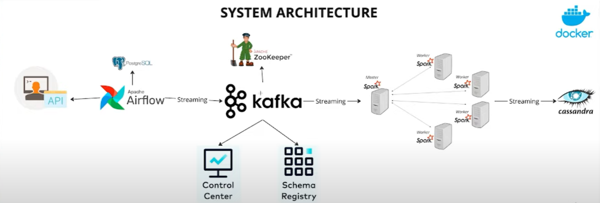

# Real_Time_Streaming_Data
Creating a live data streaming pipeline involves seamlessly handling data from ingestion through processing and ultimately storage. Our approach encompasses a robust toolkit comprising Apache Airflow, Python, Apache Kafka, Apache Zookeeper, Apache Spark, and Cassandra—all efficiently containerized using Docker.

# Project Architecture 

## 1. API
- **API Endpoint:** [Random User Generator](https://randomuser.me/)

## 2. Fetching Data
- **Technology:** Apache Airflow
- **Database:** PostgreSQL
- **DAG (Directed Acyclic Graph):** Used to fetch data from the Random User Generator API.

## 3. Streaming Data
- **Technology:** Apache Kafka
- **Queue Coordination:** Zookeeper
- **Data Flow:** Fetched data is streamed into the Apache Kafka queue.

## 4. Visualizing Data
- **Tool:** Control Center
- **Visualization:** Data inside Kafka brokers (messages in topics)
- **Metadata Retrieval:** Schema Registry

## 5. Processing Data
- **Technology:** Apache Spark
- **Job Submission:** Jobs submitted to Apache Spark master.
- **Distribution:** Master distributes jobs to worker nodes for parallel processing.

## 6. Storing Data
- **Database:** Cassandra
- **Task Completion:** Once processing is complete, data is stored in the Cassandra database.

## Additional Information
- **Containerization:** All components run on Docker instances.
  
